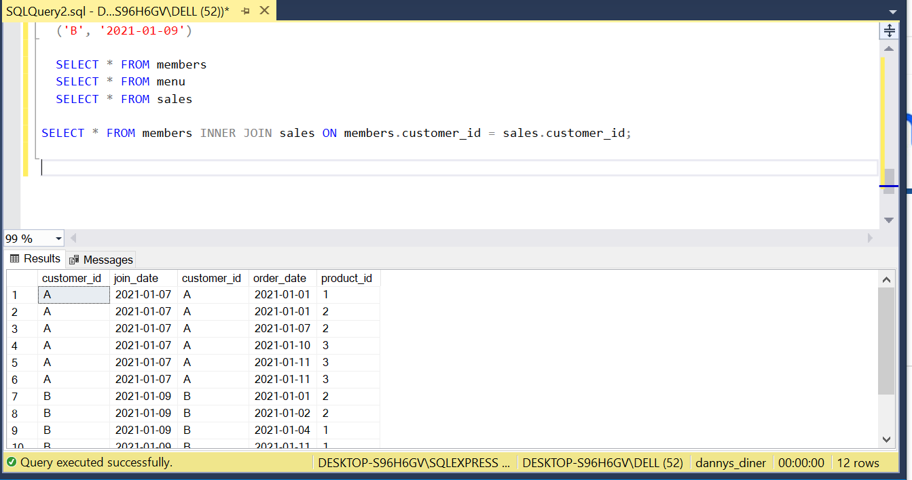
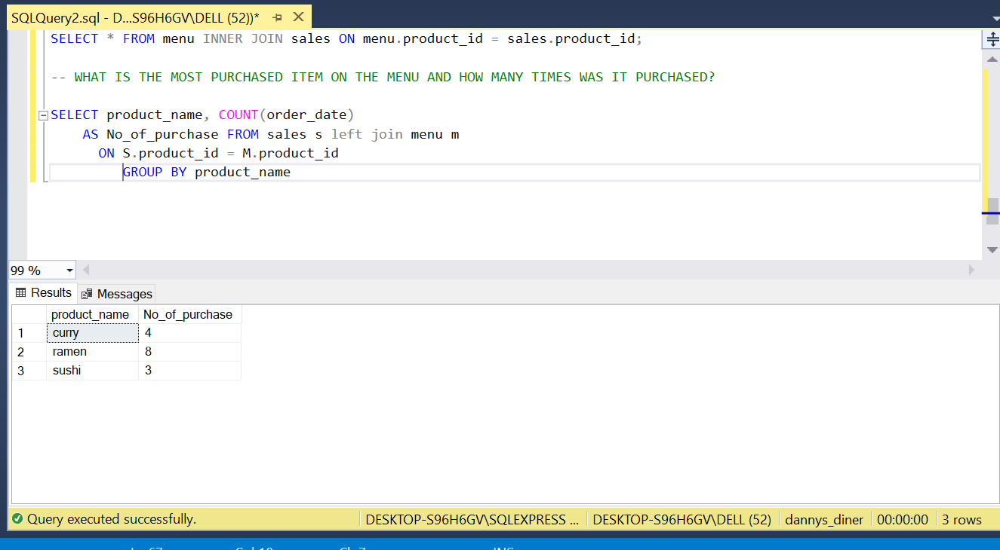
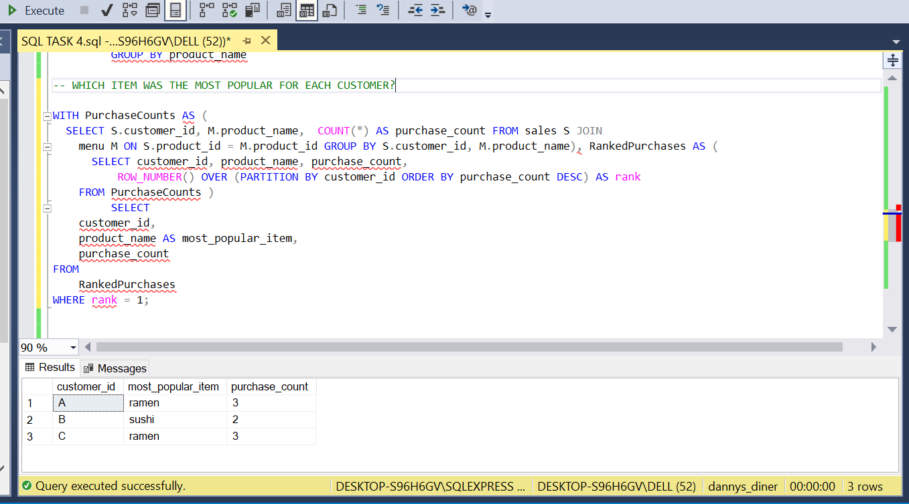
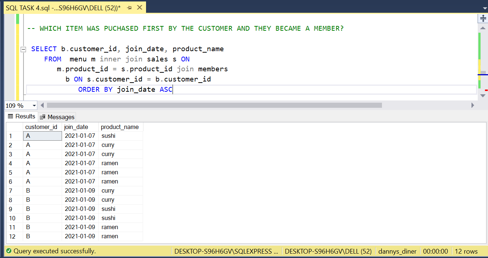
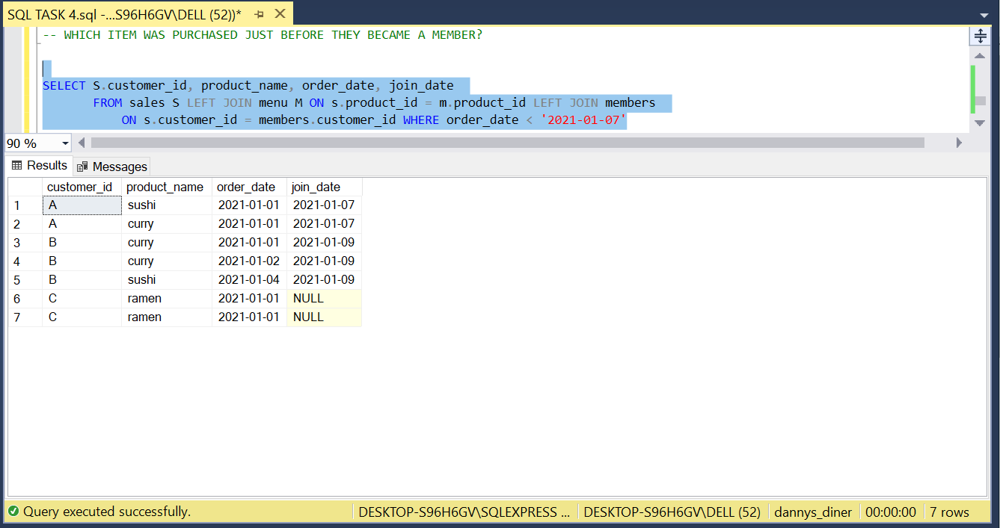
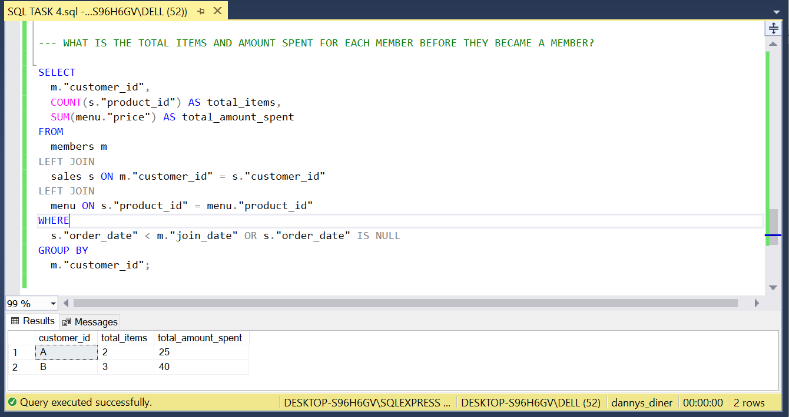

# SQL TASK FOUR

## INTRODUCTION

We were asked to solve Danny ma week one challenge, from critical study of 
the data set Danny ma loves Chinese food so in year 2021, he opens up a
little restaurant and he sells his 3 favourite foods: sushi, curry and ramen.
Danny’s Diner is in need of assistance to help the restaurant stay afloat, i'll 
be solving this business problems using SQL.

## DATASET

Database was created for this task using this syntax;
CREATE Database dannys_diner

CREATE TABLE sales (
  "customer_id" VARCHAR(1),
  "order_date" DATE,
  "product_id" INTEGER
);

INSERT INTO sales
  ("customer_id", "order_date", "product_id")
VALUES
  ('A', '2021-01-01', '1'),
  ('A', '2021-01-01', '2'),
  ('A', '2021-01-07', '2'),
  ('A', '2021-01-10', '3'),
  ('A', '2021-01-11', '3'),
  ('A', '2021-01-11', '3'),
  ('B', '2021-01-01', '2'),
  ('B', '2021-01-02', '2'),
  ('B', '2021-01-04', '1'),
  ('B', '2021-01-11', '1'),
  ('B', '2021-01-16', '3'),
  ('B', '2021-02-01', '3'),
  ('C', '2021-01-01', '3'),
  ('C', '2021-01-01', '3'),
  ('C', '2021-01-07', '3');
 

CREATE TABLE menu (
  "product_id" INTEGER,
  "product_name" VARCHAR(5),
  "price" INTEGER
);

INSERT INTO menu
  ("product_id", "product_name", "price")
VALUES
  ('1', 'sushi', '10'),
  ('2', 'curry', '15'),
  ('3', 'ramen', '12');
  

CREATE TABLE members (
  "customer_id" VARCHAR(1),
  "join_date" DATE
);

INSERT INTO members
  ("customer_id", "join_date")
VALUES
  ('A', '2021-01-07'),
  ('B', '2021-01-09')

From this code, three tables were created
- MENU
- SALES
- MEMBERS

## CASE STUDY

Each of the following case study questions was answered using a single SQL statement:
1. What is the most purchased item on the menu and how many times was it purchased by all customers?
2. Which item was the most popular for each customer?
3. Which item was purchased first by the customer after they became a member?
4. Which item was purchased just before the customer became a member?
5. What is the total items and amount spent for each member before they became a member?

## CONCEPTS DEMONSTRATED

The following were incoporated-
- COUNT
- SELECT DISTINCT
- SELECT
- ON
- FROM
- PARTITION BY
- OTHER BY
- LEFT JOIN
- GROUP BY

## SOLUTION

The first attempt was to join tables using the memeber and sales table.

---

### 1. What is the most purchased item on the menu and how many times was it purchased by all customers?

In order to attempt this question, i used left join to join table menu and sales.
According to this question the most purchased item on the menu is 'RAMEN' and it was purchased 8 times.
The result is displayed in the screenshot below.

---

### 2. Which item was the most popular for each customer?

This question took a toll on me to deliver but i was able to select product name,
customer id

---

### 3. Which item was purchased first by the customer after they became a member?

The item purchased first by a customer afterwards they became a member.
The result is displayed in the screenshot below.

---

### 4. Which item was purchased just before the customer became a member?

The result is displayed in the screenshot below.

---

### 5. What is the total items and amount spent for each member before they became a member?

The result is displayed in the screenshot below.

---

# CONCLUSION

This is one of the hardest challengeive ever done in SQL. it took a toll on me but it made me 
do more research and more learning. i hope you enjoy this fun little case study, it was fun and hard
to create

**_THE END_**
